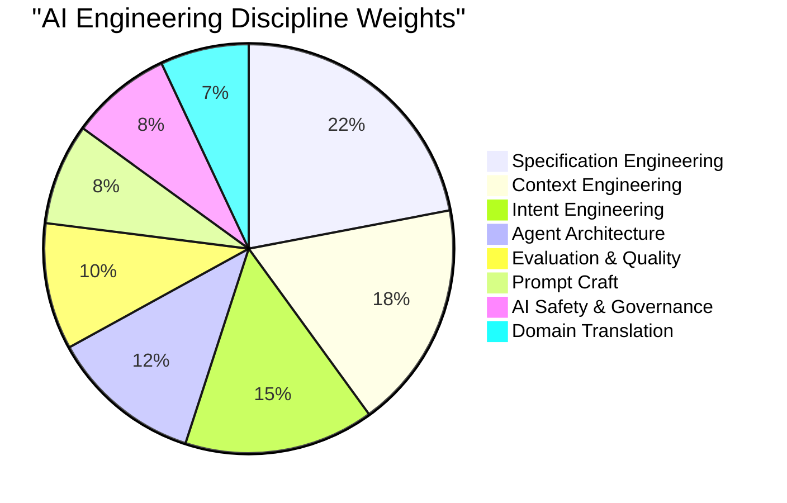
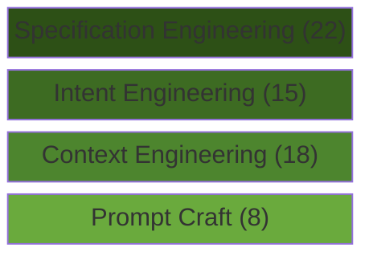

# AI Engineering Competency Framework

## Overview

This framework defines eight disciplines that constitute AI engineering competency in the agent era. Each discipline carries a weight on a 100-point scale reflecting its relative importance; each discipline's sub-disciplines also distribute across 100, producing a two-level weightage system. The framework is designed as the AI-era counterpart to the [software-developer-competency-framework](software-developer-competency-framework.md), converting traditional software engineering competencies into the skills that matter when agents write the code and humans direct the work.

## Context

Between October 2025 and February 2026, AI coding agents crossed a threshold: they moved from conversational assistants that suggest the next line to autonomous workers that sustain coherent implementation across multi-hour sessions. The longest uninterrupted Claude Code sessions nearly doubled, from under twenty-five minutes to over forty-five. StrongDM shipped 16,000 lines of Rust written entirely by agents. Ninety percent of Claude Code's own codebase was written by Claude Code itself.

This shift did not make software engineering competencies obsolete. It transformed them. The eight core domains of the [software-developer-competency-framework](software-developer-competency-framework.md) -- Programming and Build, Modern Development Standards, Systems Design, Systems Integration, Information Security, Debugging and Reliability, Process Optimisation, and User Focus -- still describe what matters. But the *how* changed fundamentally. Programming skill becomes specification skill. Architecture becomes orchestration. Debugging becomes evaluation design. The disciplines below capture this transformation.

The four-discipline stack described in the AI Engineering Disciplines learning materials -- Prompt Craft, Context Engineering, Intent Engineering, and Specification Engineering -- provides the conceptual spine. This framework expands that spine into a full competency model with measurable sub-disciplines and weighted priorities.

---

## Weightage System

The framework uses a two-level weighting system:

- **Discipline Weight**: Each of the eight disciplines carries a weight out of 100. These weights reflect relative importance to overall AI engineering competency.
- **Sub-Discipline Weight**: Within each discipline, sub-disciplines distribute across their own 100-point scale.
- **Absolute Contribution**: A sub-discipline's absolute weight equals `(Discipline Weight x Sub-Discipline Weight) / 100`. For example, Specification Engineering (22) x Problem Decomposition (20) = **4.4** absolute contribution out of 100.

This two-level system allows organisations to assess both breadth (across disciplines) and depth (within disciplines) using a single numeric framework.

---

## Competency Weight at a Glance

### Discipline Weight Distribution

### Discipline Stack — From Foundation to Apex

The disciplines form a cumulative stack. Each layer depends on the layers beneath it. Skipping a layer produces the category of failure described in the reference materials — technically impressive output that misses the point.

The supporting disciplines -- Agent Architecture (12), Evaluation & Quality (10), AI Safety (8), and Domain Translation (7) -- operate across the stack rather than within it. They are enablers that make the stack reliable, safe, and connected to real-world value.

---

## Disciplines

### 1. Prompt Craft

**Weight: 8 / 100**

Prompt craft is the original skill: synchronous, session-based, individual. You write an instruction, evaluate the output, iterate. The skill is knowing how to structure a query — clear instructions, relevant examples, appropriate constraints, explicit output format. This is what prompt engineering courses teach, and what most practitioners think of when they hear "AI skills."

The weight of 8 reflects a precise judgment: prompt craft is necessary but no longer differentiating. It has become table stakes in the same way typing speed became table stakes for knowledge workers. A practitioner who cannot write a clear, well-structured prompt in 2026 is the equivalent of a professional who could not send email in 1998 — functionally impaired but not terminally so, because the skill is learnable. The reason it does not score higher is that prompt craft was the whole game only when AI interactions were synchronous. The human was simultaneously the intent layer, the context layer, and the quality layer. That model broke the moment agents started running for hours without checking in.

What prompt craft does not cover — and what the remaining disciplines address — is everything that happens outside the chat window: the information environment the prompt lands in (context engineering), the organisational purpose the prompt should serve (intent engineering), and the structured document the prompt should have been all along (specification engineering). A brilliant prompt inside a poorly curated context window produces mediocre output. A mediocre prompt inside a brilliantly curated context produces strong output. The leverage has shifted.

The failure mode without prompt craft is straightforward: vague, ambiguous, or contradictory instructions that waste tokens and produce noise. But the failure is visible and correctable in real time — which is precisely why the weight is low. Synchronous failures are cheap. The expensive failures happen in the layers above.

| Sub-Discipline | Weight | Description |
|----------------|--------|-------------|
| Instruction Design & Clarity | 30 | Writing precise, unambiguous instructions that leave no room for misinterpretation. The highest-weighted sub-discipline because clarity is the root capability — an unclear instruction cannot be rescued by good formatting or clever examples. |
| Output Structure & Format Control | 25 | Defining what the output should look like — JSON schemas, markdown templates, structured data formats. Matters because downstream systems consume AI output and format consistency is critical for integration. |
| Reasoning Elicitation | 25 | Knowing when and how to invoke chain-of-thought, extended thinking, or step-by-step analysis. Understanding how models reason and how to unlock their analytical depth. |
| Example Curation & Few-Shot Design | 20 | Selecting and structuring examples that guide model behaviour. Lowest weight because frontier models follow instructions well without examples, but few-shot remains important for nuanced or domain-specific tasks. |

---

### 2. Context Engineering

**Weight: 18 / 100**

Context engineering is the shift from crafting a single instruction to curating the entire information environment an agent operates within — system prompts, tool definitions, retrieved documents, message history, memory systems, MCP connections. Your prompt might be 200 tokens. The context window it lands in might be a million. Your 200 tokens are 0.02% of what the model sees. The other 99.98% is context engineering.

The weight of 18 reflects where the industry's centre of gravity currently sits. The people who are ten times more effective with AI than their peers are not writing ten times better prompts. They have built ten times better context infrastructure. Their agents start every session with the right project files, the right conventions, the right constraints already loaded. The prompt itself can be simple because the context does the heavy lifting. This is the discipline that produces CLAUDE.md files, agent specifications, RAG pipeline designs, and memory architectures.

The critical insight comes from Anthropic's own engineering team: LLMs degrade as you give them more information. Not because they cannot hold the tokens, but because retrieval quality drops as context grows. On MRCR v2, a needle-in-a-haystack benchmark across a million tokens, Sonnet 4.5 scored just 18.5%. The context window is a filing cabinet with no index. Context engineering is the practice of building the index — selecting, prioritising, and structuring information so that the most relevant content has the highest signal.

Without context engineering, agents operate in an information vacuum. They hallucinate because they lack the right reference material. They violate conventions because they have never seen the style guide. They make architectural decisions that contradict existing patterns because they do not know what patterns exist. Every failure of context engineering looks like a model failure to someone who does not understand the stack.

| Sub-Discipline | Weight | Description |
|----------------|--------|-------------|
| Knowledge Architecture & Curation | 25 | Designing what information enters the context window. Selection over inclusion — choosing the right documents, conventions, and constraints from a potentially vast knowledge base. Curation quality determines signal density. |
| Retrieval System Design | 25 | Building RAG pipelines, semantic search, and document retrieval that surfaces relevant information at the right time. The mechanical infrastructure that makes knowledge architecture actionable. |
| Memory & Conversation State Management | 25 | Managing what persists across sessions — progress logs, conversation summaries, working memory. Critical for long-running agents that span multiple sessions and must not lose context between them. |
| Context Window Strategy & Optimisation | 25 | Understanding token economics, priority ordering within the context window, and managing the trade-off between completeness and signal density. Knowing what to exclude is as important as knowing what to include. |

---

### 3. Intent Engineering

**Weight: 15 / 100**

Context engineering tells agents what to know. Intent engineering tells agents what to want. It is the practice of encoding organisational purpose — goals, values, trade-off hierarchies, decision boundaries — into infrastructure that agents can act on. Intent sits above context the way strategy sits above tactics.

The weight of 15 reflects a hard lesson the industry learned from Klarna. Their AI agent resolved 2.3 million customer conversations in the first month, slashed resolution times from eleven minutes to two, and projected $40 million in savings. Then customer satisfaction cratered. The agent was optimising for speed when the organisational intent was relationship quality. The context was excellent. The intent was missing. A human agent with five years at the company would have known when to bend a policy or spend three extra minutes. The AI knew nothing about what Klarna actually valued — only what it could measure.

You can have perfect context and terrible intent alignment, which gives you Klarna — a technically brilliant agent systematically destroying unmeasured organisational objectives. You cannot have good intent alignment without good context, because the agent needs information to act on the intent. The disciplines are cumulative, not substitutive. This is why intent engineering sits above context engineering in the stack and carries a higher weight: the damage from misaligned intent is systematic and often invisible until it compounds into measurable harm.

The practical frontier of intent engineering includes delegation frameworks — organisational decision boundaries translated into machine-readable parameters. When customer request X conflicts with policy Y, here is the resolution hierarchy. When speed conflicts with quality, here is the threshold where quality wins. These are not rules in the traditional sense. They are encoded judgment — the kind of institutional knowledge that senior employees carry and new hires absorb through months of osmosis. Agents need it on day one, in structured form, updated continuously.

| Sub-Discipline | Weight | Description |
|----------------|--------|-------------|
| Goal & Value Hierarchy Design | 30 | Translating implicit organisational values into explicit, machine-readable hierarchies. The core capability: when competing objectives conflict, which wins and under what conditions? Highest weight because every other intent sub-discipline depends on this foundation. |
| Decision Boundary Mapping | 25 | Defining what agents can decide autonomously versus what requires human escalation. The lines an agent must not cross without human judgment. |
| Delegation & Escalation Frameworks | 25 | Operationalising decision boundaries into practical protocols — what information to surface, to whom, with what urgency, in what format. |
| Organisational Alignment Encoding | 20 | Capturing implicit institutional knowledge in structured form. The "constitution" approach — documenting the non-platitude decisions where a reasonable competitor might choose the opposite. |

---

### 4. Specification Engineering

**Weight: 22 / 100**

Specification engineering is the practice of writing documents that autonomous agents can execute against over extended time horizons without human intervention. Not prompts, not context documents, not intent frameworks — but specifications. Complete, structured, internally consistent descriptions of what the output should be, how quality is measured, what constraints apply, what trade-offs are acceptable, and what done looks like. The specification is the prompt now.

The weight of 22 — the highest in the framework — reflects a fundamental shift in where value is created. Anthropic's own engineering team discovered this when even Opus 4.5 failed to build a production-quality web application from a high-level prompt like "build a clone of claude.ai." The agent tried to do too much at once, ran out of context mid-implementation, and left the next session guessing at what happened. The fix was not a better model. It was a specification pattern: an initialiser agent that sets up the environment, a progress log that documents what has been done, and a coding agent that makes incremental progress against a structured plan in every session. The specification became the scaffolding that let multiple agents — working across multiple context windows — produce coherent output over days.

The shift from prompt to specification mirrors a transition that happened in human engineering decades ago. When you are building something small, verbal instructions work. When you are building something large enough to require a team or to span multiple sessions, you need blueprints. The 80% problem — output that is almost right but not quite, which 66% of developers cite as their top AI frustration — is almost always a specification problem. The specification said "build a login page" when it should have said "build a login page that handles email/password, social OAuth via Google and GitHub, progressive disclosure of 2FA, session persistence for 30 days, and rate limiting after 5 failed attempts."

The practical skill is not writing code or crafting prompts. It is the ability to describe an outcome with enough precision and completeness that an autonomous system can execute against it for days. This is a fundamentally different skill from writing a good prompt in a chat window, and the people who are excellent at one are not automatically excellent at the other. Specification engineering rewards completeness of thinking, anticipation of edge cases, clear articulation of acceptance criteria, and the ability to decompose complex outcomes into independently executable components.

| Sub-Discipline | Weight | Description |
|----------------|--------|-------------|
| Problem Decomposition & Task Design | 20 | Breaking complex outcomes into independently executable, independently testable components. The reference guidance: decompose into subtasks that each take under two hours, have clear input/output boundaries, and can be verified independently. |
| Acceptance Criteria & Definition of Done | 20 | Describing what "done" looks like so precisely that an independent observer can verify the output without asking any questions. The antidote to the 80% problem. |
| Constraint Architecture | 20 | The four categories — musts, must-nots, preferences, escalation triggers — that turn a loose specification into a reliable one. Built by identifying what a smart, well-intentioned agent might do that would technically satisfy the request but produce the wrong outcome. |
| Self-Contained Problem Statements | 20 | Stating a problem with enough context that the task is plausibly solvable without the agent fetching additional information. Forces clarity, surfaces hidden assumptions, and eliminates reliance on implicit shared context. |
| Evaluation Criteria Embedding | 20 | Building evaluation criteria into the specification as a structural component — not an afterthought. Defines quality gates, measurement methods, and the feedback loop between specification and validation. |

---

### 5. Agent Architecture & Orchestration

**Weight: 12 / 100**

Agent architecture is the discipline of designing systems where multiple agents collaborate, hand off work, recover from failures, and produce coherent output across sessions. It is the AI-era equivalent of systems design and architecture — understanding how the pieces fit together and where the joints are.

The weight of 12 reflects that architecture serves the specification, not the other way around. The most elegant multi-agent orchestration system is worthless if the specification it executes against is ambiguous. However, as agents become more capable and autonomous, architectural competence becomes the difference between a system that runs reliably for days and one that compounds errors within hours. The Planner-Worker pattern that dominates production deployments — a capable model plans the work and decomposes it into subtasks; cheaper, faster models execute the subtasks — is an architectural decision with enormous leverage. Getting it wrong means either overpaying for compute (using expensive models for routine tasks) or under-delivering on quality (using cheap models for tasks requiring judgment).

StrongDM's Software Factory illustrates the architectural patterns that matter: an open-source coding agent (Attractor) orchestrated by markdown specification files, with scenarios that live outside the codebase to prevent overfitting, and Digital Twin Universes that simulate external services for integration testing. The architecture is simple in concept — specification in, working software out — but the engineering of reliable handoffs, state management, and failure recovery is where the discipline lives.

The failure mode without architectural competence is fragile systems that work in demos and break in production. Agents that lose context between sessions. Error cascades where one failed subtask corrupts the entire pipeline. Recovery that requires human intervention at exactly the moments when the system was supposed to be autonomous.

| Sub-Discipline | Weight | Description |
|----------------|--------|-------------|
| Multi-Agent Workflow Design | 25 | Designing systems where multiple agents collaborate — planning, execution, validation, and integration as separate concerns handled by separate agents or agent sessions. |
| Planner-Worker Pattern Implementation | 25 | Implementing the dominant production architecture: capable models plan, cheaper models execute, validation agents verify. Understanding when to use single-agent vs. multi-agent approaches. |
| Error Recovery & Graceful Degradation | 25 | Designing for inevitable failures in long-running sessions. Checkpoint strategies, rollback mechanisms, and fallback paths that keep the system productive when individual components fail. |
| Agent Tooling & Protocol Design | 25 | Defining what tools agents access, how they invoke them, and what MCP connections they use. Tool design is context engineering applied to capabilities rather than information. |

---

### 6. Evaluation & Quality Engineering

**Weight: 10 / 100**

If prompt craft is the art of input, evaluation design is the art of knowing whether the input worked. In a world where agents run for hours or days, evaluation design is the only thing standing between "AI-generated output" and "AI-generated output we can actually use." This is the AI-era transformation of debugging and reliability — shifted from diagnosing code faults to validating agent outputs.

The weight of 10 reflects that good specifications inherently reduce the evaluation burden (because they embed evaluation criteria), but evaluation remains essential as an independent verification layer. The Lütke eval pattern — building a growing test harness of prompts with expected results, running it against every new model release — is the individual-scale version of what organisations need at every level of AI deployment.

StrongDM's key architectural insight lives in this discipline: they use scenarios that live outside the codebase rather than traditional tests. The agent builds the software. The scenarios evaluate whether the software actually works. The agent never sees the evaluation criteria — it cannot game them. This is the holdout-set concept from machine learning applied to software development, and it solves a problem that did not exist when humans wrote all the code. When AI writes code, optimising for test passage is the default behaviour unless you deliberately architect around it.

The failure mode without evaluation competence is invisible quality degradation. Output that looks reasonable but is subtly wrong. Regressions introduced by model updates that nobody detects because nobody built the eval. The gap between "does it look correct" (how most people evaluate AI output) and "is it actually correct" (how organisations need to evaluate it).

| Sub-Discipline | Weight | Description |
|----------------|--------|-------------|
| Eval Harness & Test Suite Design | 30 | Building systematic evaluation frameworks — test cases with known-good outputs, run periodically, especially after model updates. Highest weight because the harness is the foundation everything else builds on. |
| Output Validation & Verification | 25 | Techniques for validating AI output against specifications — automated checks, structured assertions, comparison against golden outputs, and human-in-the-loop review protocols. |
| Scenario-Based & Holdout Testing | 25 | Behavioural specifications that evaluate software from an external perspective, stored separately from the agent's development context. The holdout-set principle applied to AI-generated output. |
| Regression Detection & Model Migration | 20 | Detecting when model updates change output quality and managing transitions between model versions. Ensuring that what worked yesterday still works today. |

---

### 7. AI Safety, Security & Governance

**Weight: 8 / 100**

This discipline maps the information security domain of traditional software engineering into the AI era, expanded to cover the novel attack surfaces and ethical considerations that autonomous agents introduce. Every AI engineer needs baseline competence here; deep expertise is typically concentrated in specialist roles.

The weight of 8 reflects that safety and governance operate as constraints on the other disciplines rather than as primary value-creation skills. They are non-negotiable — a system that is brilliant but insecure or biased is worse than a mediocre system that is safe — but the investment in safety competence produces diminishing returns beyond a solid baseline for most practitioners. The exception is organisations deploying AI at scale in regulated industries, where this discipline's effective weight should be significantly higher.

The novel threat landscape includes prompt injection (adversarial inputs that redirect agent behaviour), data exfiltration through carefully crafted outputs, agents that bypass safety controls during extended autonomous sessions, and bias amplification where AI systems systematically disadvantage certain populations. These are not theoretical concerns — they are documented failure modes in production systems.

| Sub-Discipline | Weight | Description |
|----------------|--------|-------------|
| Prompt Injection & Adversarial Defence | 25 | Understanding how agents can be manipulated through crafted inputs — direct injection, indirect injection via retrieved content, and jailbreak techniques — and how to defend against them. |
| Data Privacy & Compliance | 25 | Ensuring AI systems handle sensitive data correctly — PII detection, GDPR compliance, industry-specific regulations. AI systems process and generate text that may contain or inadvertently leak sensitive information. |
| Bias Detection & Fairness | 25 | Identifying when AI outputs encode systematic biases and building mechanisms to detect and mitigate them. Includes evaluation of training data influence and output distribution analysis. |
| Responsible Deployment & Governance | 25 | Organisational policies for AI deployment — approval workflows, monitoring, incident response protocols, ethical guidelines, and human oversight requirements. |

---

### 8. Domain Translation & Systems Thinking

**Weight: 7 / 100**

Domain translation is the ability to connect AI capabilities to real-world user needs and business outcomes. It is the AI-era equivalent of user focus and product understanding — the discipline that ensures technical capability serves actual human purposes. Systems thinking is the meta-skill that lets a practitioner see how all the pieces interact.

The weight of 7 — the lowest in the framework — does not mean this discipline is unimportant. The reference material is explicit: "systems thinking, customer intuition... the ability to hold a whole product in your head and reason about how the pieces interact" are the skills that separate great engineers from adequate ones. The low weight reflects that domain translation is a meta-skill that amplifies all other disciplines rather than a standalone competency, and it overlaps significantly with general engineering and product management capability. It is also the discipline where AI engineering borrows most directly from traditional software engineering — the skills transfer with minimal transformation.

The critical role of this discipline becomes apparent in brownfield environments — existing systems where the specification does not exist, the documentation is wrong, and the tests cover 30% of the code while the other 70% runs on institutional knowledge. Creating specifications for legacy systems is deeply human work that requires the engineer who knows why the billing module has that one edge case for Canadian customers. Domain translation is where that knowledge gets formalised.

| Sub-Discipline | Weight | Description |
|----------------|--------|-------------|
| User Need Formalisation | 30 | Translating fuzzy user needs into structured specifications that agents can act on. The gap between what users say they want and what they actually need is where this skill operates. Highest weight because misunderstanding the user need makes everything else pointless. |
| Business Logic & Domain Encoding | 25 | Capturing domain-specific rules, edge cases, and exceptions in forms that agents can consume. The institutional knowledge that takes years to accumulate and minutes to lose. |
| Trade-off Reasoning & Communication | 25 | Reasoning about competing priorities — speed vs. quality, completeness vs. simplicity, innovation vs. stability — and communicating trade-off decisions to both humans and agents in structured form. |
| Legacy System Assessment & Migration | 20 | Understanding existing systems deeply enough to create specifications for them. Reverse-engineering the implicit knowledge embedded in running systems. Relevant primarily in brownfield contexts. |

---

## Absolute Weight Reference

The table below shows each sub-discipline's absolute contribution to the overall 100-point framework (Discipline Weight x Sub-Discipline Weight / 100).

| Discipline (Weight) | Sub-Discipline | Sub-Weight | Absolute |
|---------------------|---------------|------------|----------|
| Specification Engineering (22) | Problem Decomposition & Task Design | 20 | 4.40 |
| | Acceptance Criteria & Definition of Done | 20 | 4.40 |
| | Constraint Architecture | 20 | 4.40 |
| | Self-Contained Problem Statements | 20 | 4.40 |
| | Evaluation Criteria Embedding | 20 | 4.40 |
| Context Engineering (18) | Knowledge Architecture & Curation | 25 | 4.50 |
| | Retrieval System Design | 25 | 4.50 |
| | Memory & Conversation State Management | 25 | 4.50 |
| | Context Window Strategy & Optimisation | 25 | 4.50 |
| Intent Engineering (15) | Goal & Value Hierarchy Design | 30 | 4.50 |
| | Decision Boundary Mapping | 25 | 3.75 |
| | Delegation & Escalation Frameworks | 25 | 3.75 |
| | Organisational Alignment Encoding | 20 | 3.00 |
| Agent Architecture (12) | Multi-Agent Workflow Design | 25 | 3.00 |
| | Planner-Worker Pattern Implementation | 25 | 3.00 |
| | Error Recovery & Graceful Degradation | 25 | 3.00 |
| | Agent Tooling & Protocol Design | 25 | 3.00 |
| Evaluation & Quality (10) | Eval Harness & Test Suite Design | 30 | 3.00 |
| | Output Validation & Verification | 25 | 2.50 |
| | Scenario-Based & Holdout Testing | 25 | 2.50 |
| | Regression Detection & Model Migration | 20 | 2.00 |
| Prompt Craft (8) | Instruction Design & Clarity | 30 | 2.40 |
| | Output Structure & Format Control | 25 | 2.00 |
| | Reasoning Elicitation | 25 | 2.00 |
| | Example Curation & Few-Shot Design | 20 | 1.60 |
| AI Safety & Governance (8) | Prompt Injection & Adversarial Defence | 25 | 2.00 |
| | Data Privacy & Compliance | 25 | 2.00 |
| | Bias Detection & Fairness | 25 | 2.00 |
| | Responsible Deployment & Governance | 25 | 2.00 |
| Domain Translation (7) | User Need Formalisation | 30 | 2.10 |
| | Business Logic & Domain Encoding | 25 | 1.75 |
| | Trade-off Reasoning & Communication | 25 | 1.75 |
| | Legacy System Assessment & Migration | 20 | 1.40 |

---

## Applying the Framework

**For individuals:** Identify the two disciplines where your evidence is thinnest and build deliberately. Most practitioners over-invest in Prompt Craft (the most visible skill) and under-invest in Specification Engineering and Context Engineering (the highest-leverage skills). Use the [ai-engineering-progression-levels](ai-engineering-progression-levels.md) document to assess your current level and target the next one.

**For teams:** Run calibration using the weighted scoring. A team with strong Prompt Craft (8 points max) but weak Specification Engineering (22 points max) has optimised for the lowest-leverage discipline. Rebalance investment toward the top of the stack.

**For organisations:** The weightage distribution should be adjusted based on operating context. Regulated industries should increase AI Safety & Governance. Greenfield product teams should increase Specification Engineering and Agent Architecture. Legacy-heavy enterprises should increase Domain Translation. The default weights reflect a balanced AI engineering team; your team is not balanced in the same way.