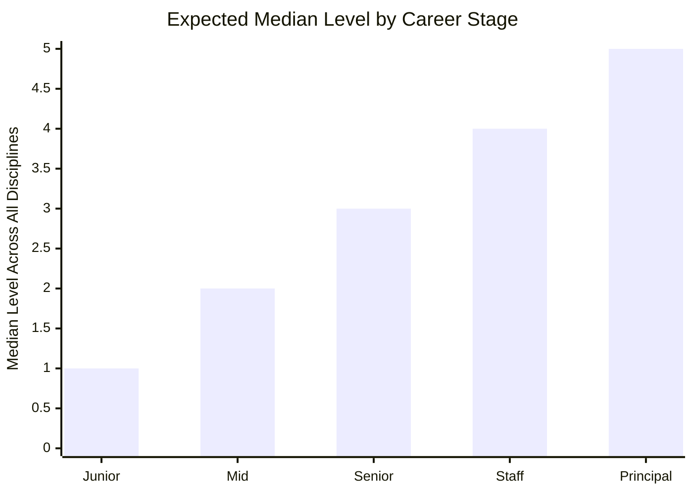

# AI Engineering Progression Levels

## Overview

This document defines five progression levels for each of the eight AI engineering disciplines described in the [ai-engineering-competency-framework](ai-engineering-competency-framework.md). Each level specifies what competence looks like and what observable evidence demonstrates it. The levels are cumulative — each builds on the capabilities of the level below.

## Context

Traditional software engineering frameworks use four proficiency grades (Awareness, Working, Practitioner, Expert) or five to six career levels (Junior through Principal). This framework uses five levels calibrated specifically for AI engineering, where the skills are new enough that even experienced software engineers may start at Level 1 in some disciplines. The levels are independent of job title — a Staff Engineer might be Level 4 in Prompt Craft but Level 2 in Specification Engineering.

---

## The Five Levels

| Level | Label | Definition | Analogy |
|-------|-------|-----------|---------|
| **1** | **Novice** | Understands the discipline conceptually. Can recognise its components and vocabulary. Cannot apply independently. Requires close guidance. | Knows the rules of chess; cannot play a real game without help. |
| **2** | **Apprentice** | Applies basic techniques with guidance. Handles routine situations. Follows established patterns and templates. Developing confidence through practice. | Plays chess competently using known openings; loses to unfamiliar positions. |
| **3** | **Practitioner** | Applies independently across standard and complex situations. Creates reusable patterns. Supports others. Handles ambiguity within known domains. | Plays chess at club level; adapts to unexpected positions; coaches beginners. |
| **4** | **Strategist** | Leads and designs at team or project level. Resolves novel problems. Sets team-level standards. Anticipates failure modes before they occur. | Plays chess at tournament level; develops original strategies; trains others. |
| **5** | **Architect** | Sets strategic direction at organisational scale. Defines the discipline's standards. Resolves the most ambiguous and novel challenges. Advances the practice. | Plays chess at master level; writes theory; shapes how others learn the game. |

### Level Distribution Across Career

> [!note]
> These are medians, not requirements. A Senior engineer might be Level 4 in their strongest discipline and Level 2 in their weakest. The framework measures depth within each discipline, not a single aggregate score.

---

## Progression by Discipline

### 1. Prompt Craft (Weight: 8)

| Level | What It Looks Like | Observable Evidence |
|-------|-------------------|---------------------|
| **1 — Novice** | Writes basic prompts using natural language. Gets usable results for simple tasks. Understands that prompt quality affects output quality but cannot articulate why specific phrasings work better. | Can use a chat interface to get answers. Prompts are conversational and imprecise. Outputs require significant manual rework. |
| **2 — Apprentice** | Structures prompts with clear instructions, constraints, and output format requirements. Uses system prompts effectively. Applies basic chain-of-thought when appropriate. | Prompts include explicit formatting requirements. Uses role-based prompting. Follows established prompt templates. Outputs require moderate rework. |
| **3 — Practitioner** | Crafts prompts that consistently produce high-quality output on first attempt. Understands model-specific behaviours and adjusts accordingly. Designs reusable prompt templates for team use. | Maintains a personal library of effective prompts. Can debug why a prompt produces poor output and fix it. Creates prompt templates others adopt. Minimal rework needed. |
| **4 — Strategist** | Designs prompt architectures for complex multi-step tasks. Understands token-level mechanics and their impact on output. Sets prompting standards for the team. Teaches others effectively. | Defines team prompt conventions and style guides. Reviews others' prompts and improves them. Handles edge cases that defeat standard patterns. Designs prompts for novel task types. |
| **5 — Architect** | Defines prompting strategy at organisational scale. Evaluates and documents model-specific prompt behaviours systematically. Contributes to the broader field's understanding of effective prompting. | Publishes internal or external guidance on prompting technique. Runs systematic evaluations of prompt strategies across models. Establishes organisational prompt governance. |

---

### 2. Context Engineering (Weight: 18)

| Level | What It Looks Like | Observable Evidence |
|-------|-------------------|---------------------|
| **1 — Novice** | Understands that AI output quality depends on the information provided. Can paste relevant content into a chat window. Aware that system prompts and CLAUDE.md files exist. | Manually copies context into conversations. No structured approach to context management. Limited awareness of context window constraints. |
| **2 — Apprentice** | Builds basic context documents (CLAUDE.md files, project descriptions). Understands that context window has limits and that not all information is equally useful. Uses basic retrieval tools. | Maintains a working CLAUDE.md for their project. Can explain what a RAG pipeline does. Uses tool integrations (MCP) with guidance. Context documents are functional but not optimised. |
| **3 — Practitioner** | Designs context architectures for projects — what information loads when, in what priority order, at what granularity. Builds and tunes RAG pipelines. Manages conversation state across sessions. | Context documents are curated for signal density. Implements working RAG systems. Designs memory strategies for multi-session agents. Can diagnose when poor output stems from context issues vs. model issues. |
| **4 — Strategist** | Designs context infrastructure at team or product level. Optimises retrieval systems for precision and recall. Implements sophisticated memory architectures. Sets context engineering standards for the team. | Builds shared context infrastructure used by multiple agents or team members. Measures and improves retrieval quality. Designs context strategies for long-running autonomous agents. Mentors others on context engineering. |
| **5 — Architect** | Defines context engineering strategy at organisational scale. Evaluates and selects embedding models, vector databases, and retrieval architectures. Designs enterprise-wide knowledge management systems purpose-built for agent consumption. | Architects cross-organisational context systems. Benchmarks and evaluates retrieval approaches systematically. Publishes standards for context quality measurement. Shapes how the organisation thinks about information architecture for AI. |

---

### 3. Intent Engineering (Weight: 15)

| Level | What It Looks Like | Observable Evidence |
|-------|-------------------|---------------------|
| **1 — Novice** | Understands that AI systems need goals beyond task completion. Recognises that agents can optimise for the wrong objective. Aware that organisational values should influence AI behaviour. | Can articulate why an AI might produce technically correct but undesirable output. Understands the Klarna case study conceptually. Cannot yet encode intent into agent infrastructure. |
| **2 — Apprentice** | Writes basic goal statements for agents. Defines simple escalation rules (e.g., "escalate if the user mentions legal"). Understands the difference between measurable metrics and actual organisational values. | Agent instructions include explicit goal statements. Basic escalation triggers are defined. Can identify when an agent's output conflicts with unstated organisational preferences. |
| **3 — Practitioner** | Designs intent hierarchies for projects — what the agent optimises for, in what priority order, with what trade-off rules. Creates delegation frameworks that specify autonomous vs. human decision zones. | Documents goal hierarchies with explicit conflict resolution rules. Builds delegation frameworks that agents follow reliably. Can diagnose intent misalignment when agent output is technically correct but practically wrong. |
| **4 — Strategist** | Designs intent infrastructure at team or department level. Translates organisational strategy into machine-readable decision boundaries. Builds "constitutions" — documents capturing the non-obvious decisions the organisation makes. | Creates organisational constitutions used by multiple agents. Designs intent frameworks that bridge product strategy and agent behaviour. Reviews and improves others' intent specifications. Handles the hardest cases: ambiguous values, competing stakeholder interests. |
| **5 — Architect** | Defines intent engineering standards at organisational scale. Designs systems for continuous intent calibration as organisational values evolve. Connects intent engineering to corporate governance and risk management. | Establishes organisation-wide intent governance. Designs feedback loops between agent behaviour and intent specification refinement. Publishes standards for intent measurement and alignment verification. Advises leadership on intent-related risk. |

---

### 4. Specification Engineering (Weight: 22)

| Level | What It Looks Like | Observable Evidence |
|-------|-------------------|---------------------|
| **1 — Novice** | Understands that AI agents need more than a brief instruction to produce quality output. Recognises the difference between a prompt and a specification. Aware that ambiguity produces ambiguous software. | Can explain why "build a login page" is insufficient as a specification. Reads and follows specifications written by others. Cannot yet write specifications independently. |
| **2 — Apprentice** | Writes basic specifications with acceptance criteria for well-scoped tasks. Decomposes simple projects into subtasks. Follows specification templates. Defines what "done" looks like for straightforward deliverables. | Produces specifications for single-feature tasks. Uses acceptance criteria that an observer could verify. Follows team specification templates. Subtask decomposition works for simple projects but misses dependencies in complex ones. |
| **3 — Practitioner** | Writes comprehensive specifications for complex, multi-component projects. Decomposes effectively — subtasks are independently executable and testable. Builds constraint architectures that prevent predictable failure modes. Writes self-contained problem statements. | Specifications are complete enough that agents produce correct output on first execution. Constraint architecture covers musts, must-nots, preferences, and escalation triggers. Subtasks have clear input/output boundaries. Evaluation criteria are embedded in the specification. |
| **4 — Strategist** | Designs specification standards and templates for the team. Writes specifications for the most complex and ambiguous projects. Anticipates failure modes that others miss. Reviews and improves others' specifications. Teaches specification engineering. | Owns specification standards for the team. Handles projects that span multiple agents, sessions, and days. Specifications include progress logging, checkpoint strategies, and session handoff protocols. Mentors others through specification reviews. |
| **5 — Architect** | Defines specification engineering practice at organisational scale. Designs specification architectures for enterprise-level autonomous systems. Advances the craft — develops new specification patterns for novel problem types. | Establishes specification governance across the organisation. Designs specification systems for dark-factory-level operations (Level 4/5 autonomous development). Creates tooling and frameworks that improve specification quality at scale. Contributes to the broader field's understanding of human-agent contracts. |

---

### 5. Agent Architecture & Orchestration (Weight: 12)

| Level | What It Looks Like | Observable Evidence |
|-------|-------------------|---------------------|
| **1 — Novice** | Understands that agents can use tools, run in sessions, and work autonomously. Aware that multi-agent systems exist. Knows the difference between a chat interaction and an agent workflow. | Uses single-agent tools (Claude Code, Cursor) effectively. Understands what an MCP connection does. Cannot yet design agent workflows. |
| **2 — Apprentice** | Configures agent tools and MCP connections. Sets up basic agent workflows with defined steps. Understands the Planner-Worker pattern conceptually and can implement simple versions. | Configures agents with appropriate tool access. Builds linear agent workflows (step A, then step B, then step C). Implements basic error handling in agent sessions. |
| **3 — Practitioner** | Designs multi-agent workflows for production use. Implements Planner-Worker patterns with appropriate model selection for each role. Builds error recovery and checkpoint strategies. Manages agent state across sessions. | Deploys multi-agent systems that run reliably in production. Selects appropriate models for different agent roles (capable for planning, efficient for execution). Implements progress logging and session handoff. Agents recover gracefully from failures. |
| **4 — Strategist** | Designs agent architectures for complex, multi-day autonomous operations. Builds orchestration frameworks used by the team. Optimises for cost, latency, and reliability. Evaluates and selects agent tooling. | Architects agent systems that span days and multiple model versions. Builds reusable orchestration patterns. Optimises token spend and compute allocation. Evaluates new agent frameworks and protocols. Sets team standards for agent architecture. |
| **5 — Architect** | Defines agent architecture standards at organisational scale. Designs Digital Twin environments for agent testing. Architects factory-level autonomous systems. Evaluates emerging agent protocols and platforms. | Designs organisation-wide agent infrastructure. Builds simulated environments (Digital Twin Universes) for autonomous development. Architects Level 5 (dark factory) systems. Contributes to industry standards for agent interoperability. |

---

### 6. Evaluation & Quality Engineering (Weight: 10)

| Level | What It Looks Like | Observable Evidence |
|-------|-------------------|---------------------|
| **1 — Novice** | Reviews AI output manually. Understands that AI output can be wrong even when it looks correct. Aware that evaluation should be systematic, not just impressionistic. | Catches obvious errors in AI output. Reviews output by reading it, not by testing it against criteria. No systematic evaluation process. |
| **2 — Apprentice** | Builds basic eval suites — a small set of test cases with known-good outputs. Runs evals manually when models change. Compares AI output against acceptance criteria defined in specifications. | Maintains 3-5 eval cases for recurring tasks. Can identify when a model update has changed output quality. Validates output against specification criteria. Eval is manual but consistent. |
| **3 — Practitioner** | Designs comprehensive eval harnesses. Builds automated validation pipelines. Implements scenario-based testing with holdout sets. Diagnoses the difference between model failure and specification failure when output is wrong. | Eval harnesses run automatically on model updates. Scenario suites test agent behaviour from an external perspective. Can distinguish specification gaps from model capability gaps. Measures output quality quantitatively. |
| **4 — Strategist** | Designs evaluation strategy at team or project level. Builds evaluation frameworks for the most complex agent systems. Implements regression detection across model versions. Sets evaluation standards for the team. | Owns team evaluation standards. Builds eval systems for multi-agent, multi-session workflows. Implements statistical methods for quality measurement. Mentors others on evaluation design. Manages model migration with quantified quality gates. |
| **5 — Architect** | Defines evaluation standards at organisational scale. Designs evaluation infrastructure that serves as the quality backbone for autonomous development. Connects evaluation to business outcomes, not just technical correctness. | Establishes organisation-wide evaluation governance. Designs eval systems that support dark-factory-level operations. Links evaluation metrics to business KPIs. Publishes standards for AI output quality measurement. |

---

### 7. AI Safety, Security & Governance (Weight: 8)

| Level | What It Looks Like | Observable Evidence |
|-------|-------------------|---------------------|
| **1 — Novice** | Understands that AI systems have security vulnerabilities distinct from traditional software. Aware that bias exists in AI output. Knows that sensitive data requires special handling. | Can explain what prompt injection is. Follows team security policies when using AI tools. Does not expose sensitive data in prompts. |
| **2 — Apprentice** | Applies basic security practices in AI workflows. Identifies common prompt injection vectors. Handles PII and sensitive data according to established guidelines. Understands relevant compliance requirements. | Implements input validation on agent interactions. Avoids common security anti-patterns (e.g., exposing API keys in context). Follows data classification rules when designing agent workflows. Reports security concerns. |
| **3 — Practitioner** | Designs secure agent workflows. Implements adversarial testing for prompt injection. Builds privacy-preserving data pipelines for AI consumption. Conducts bias audits on agent outputs. | Runs adversarial testing as part of agent deployment. Implements data anonymisation in agent pipelines. Produces bias audit reports. Designs agent permissions models that follow least-privilege principles. |
| **4 — Strategist** | Designs security architecture for multi-agent systems. Leads threat modelling for AI deployments. Implements governance frameworks for AI usage within the team or department. Sets security standards for agent development. | Produces threat models for AI systems. Designs agent security architectures used by the team. Implements automated security scanning for agent workflows. Establishes governance protocols for AI deployment approval. |
| **5 — Architect** | Defines AI security and governance strategy at organisational scale. Designs enterprise-wide AI governance frameworks. Connects AI safety to regulatory compliance and corporate risk management. | Establishes organisation-wide AI governance policies. Designs security architecture for enterprise agent deployments. Represents the organisation on AI safety matters. Shapes industry standards for responsible AI deployment. |

---

### 8. Domain Translation & Systems Thinking (Weight: 7)

| Level | What It Looks Like | Observable Evidence |
|-------|-------------------|---------------------|
| **1 — Novice** | Understands that AI capabilities must connect to user needs and business outcomes. Recognises that technical solutions exist to serve human purposes, not the reverse. | Can describe who uses the system and why. Follows product requirements when directing agents. Does not yet translate between user language and specification language independently. |
| **2 — Apprentice** | Translates simple user needs into agent task descriptions. Encodes basic business rules into specifications. Understands the domain well enough to catch obviously wrong agent output. | Writes task descriptions that reflect user intent, not just technical requirements. Catches domain-specific errors in agent output (e.g., wrong business rule applied). Participates in product discussions. |
| **3 — Practitioner** | Translates complex user needs into comprehensive specifications. Encodes nuanced business logic — edge cases, exceptions, domain-specific constraints. Reasons about trade-offs between technical elegance and user value. Makes sound judgment calls about when to simplify. | Specifications reflect deep domain understanding. Edge cases and exceptions are captured in constraint architecture. Trade-off decisions are documented and defensible. Product managers trust their domain translations. |
| **4 — Strategist** | Leads domain translation for the most complex projects. Creates domain knowledge bases that agents consume. Reasons about legacy system migration — what the system does vs. what the documentation says. Bridges technical and business stakeholders. | Creates reusable domain knowledge repositories. Leads specification work for legacy system migration. Translates business strategy into technical specification priorities. Trusted by both engineering and product leadership for trade-off judgment. |
| **5 — Architect** | Defines how the organisation captures and maintains domain knowledge for AI consumption. Designs systems for continuous domain knowledge extraction from legacy systems. Connects product strategy to AI capability roadmaps. | Architects enterprise domain knowledge systems. Designs processes for reverse-engineering institutional knowledge from running systems. Connects product vision to specification engineering at organisational scale. Shapes hiring criteria for domain expertise. |

---

## Cross-Discipline Summary

The table below maps expected level ranges by career stage. These are guidelines, not requirements — individual profiles will vary significantly.

| Discipline | Junior (L0-L1) | Mid (L1-L2) | Senior (L2-L3) | Staff (L3-L4) | Principal (L5) |
|-----------|----------------|-------------|-----------------|----------------|----------------|
| Prompt Craft | 1-2 | 2-3 | 3-4 | 4 | 4-5 |
| Context Engineering | 1 | 1-2 | 2-3 | 3-4 | 4-5 |
| Intent Engineering | 1 | 1-2 | 2-3 | 3-4 | 4-5 |
| Specification Engineering | 1 | 1-2 | 2-3 | 3-4 | 4-5 |
| Agent Architecture | 1 | 1-2 | 2-3 | 3-4 | 4-5 |
| Evaluation & Quality | 1 | 1-2 | 2-3 | 3-4 | 4-5 |
| AI Safety & Governance | 1 | 1-2 | 2-3 | 3-4 | 4-5 |
| Domain Translation | 1 | 1-2 | 2-3 | 3-4 | 4-5 |

> [!tip]
> Use this table to identify where you are ahead of or behind the expected curve. Focus development effort on the disciplines with the highest framework weight where your level is below the expected range for your career stage. A Senior engineer at Level 1 in Specification Engineering (weight 22) should prioritise that over reaching Level 5 in Prompt Craft (weight 8).

---

## Assessment Method

For each discipline at each level, evidence should be drawn from observable artifacts:

- **Specifications written** — quality, completeness, and outcome of agent execution against them
- **Context architectures designed** — signal density, retrieval quality, agent performance improvement
- **Eval harnesses built** — coverage, detection rate, regression prevention
- **Agent systems deployed** — reliability, cost efficiency, autonomous run duration
- **Incident analyses** — ability to diagnose whether failures stem from specification, context, intent, or model capability
- **Mentoring and teaching** — evidence of levelling up others in the discipline

> [!warning]
> Self-assessment in AI engineering is unreliable. The METR study found developers predicted AI would make them 24% faster while actually being 19% slower — and they still believed it after the study ended. Peer assessment and artifact-based evaluation are essential. Ratings without evidence should be challenged.