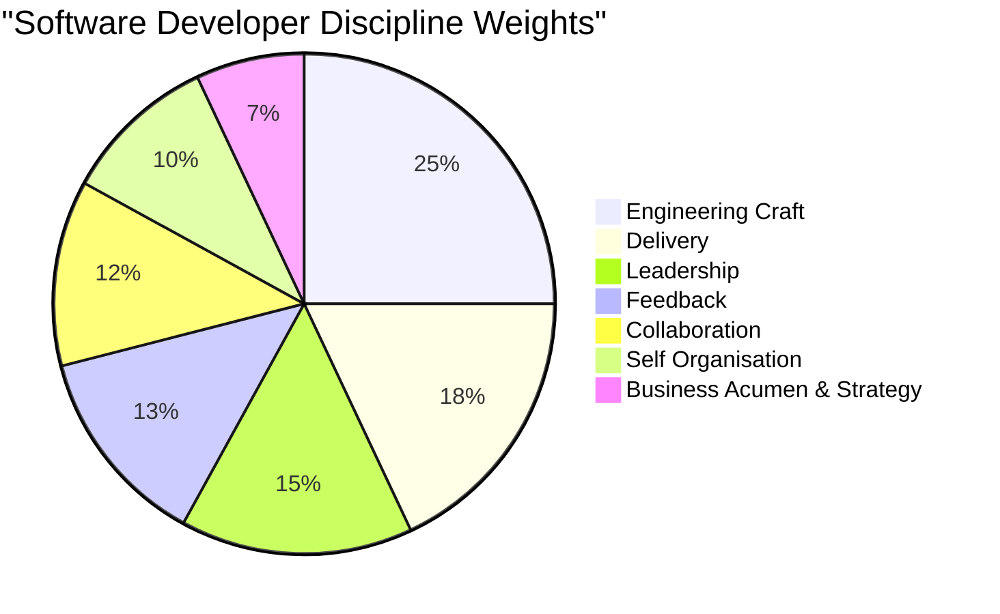
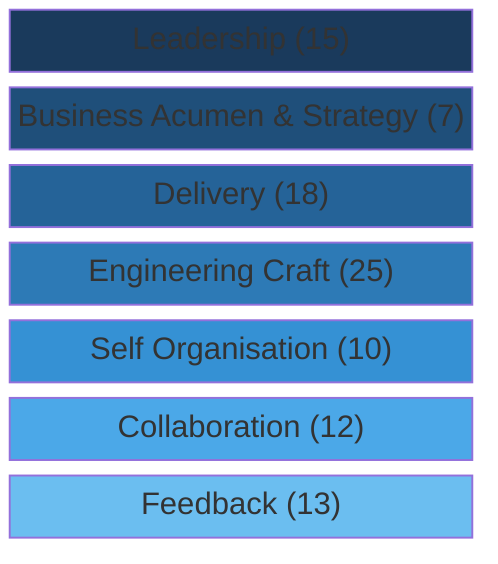

# Software Developer Competency Framework

## Overview

This framework defines seven disciplines that constitute software engineering competency. Each discipline carries a weight on a 100-point scale reflecting its relative importance; each discipline's sub-disciplines also distribute across 100, producing a two-level weightage system. The framework captures the full breadth of what makes an effective software developer -- from the technical craft of writing and understanding code through the delivery, collaboration, and leadership skills that turn individual capability into team and organisational impact.

## Context

Software engineering has never been a purely technical discipline. The industry's recurring lesson -- from the Mythical Man-Month in 1975 through the Agile Manifesto in 2001 to the DevOps and platform engineering movements of the 2020s -- is that the human side of software development determines outcomes at least as much as the technical side. A brilliant programmer who cannot break down work, communicate with stakeholders, or collaborate with a team will consistently underperform a competent programmer who can.

This framework organises software engineering competency into seven disciplines drawn from established engineering practice. The disciplines are not independent -- delivery depends on engineering craft, leadership depends on collaboration, business acumen depends on feedback. But each discipline represents a distinct category of skill that can be assessed and developed independently.

The seven disciplines fall into two natural groups. **Engineering Craft** is the technical foundation -- the skills specific to building software. The remaining six disciplines -- Delivery, Self Organisation, Feedback, Collaboration, Leadership, and Business Acumen & Strategy -- are the professional and interpersonal skills that determine whether technical ability translates into real-world impact. Engineering Craft carries the highest individual weight (25), but the professional disciplines collectively carry 75, reflecting the reality that software engineering is fundamentally a team discipline.

---

## Weightage System

The framework uses a two-level weighting system:

- **Discipline Weight**: Each of the seven disciplines carries a weight out of 100. These weights reflect relative importance to overall software engineering competency.
- **Sub-Discipline Weight**: Within each discipline, sub-disciplines distribute across their own 100-point scale.
- **Absolute Contribution**: A sub-discipline's absolute weight equals `(Discipline Weight x Sub-Discipline Weight) / 100`. For example, Engineering Craft (25) x Writing Code (18) = **4.50** absolute contribution out of 100.

This two-level system allows organisations to assess both breadth (across disciplines) and depth (within disciplines) using a single numeric framework.

---

## Competency Weight at a Glance

### Discipline Weight Distribution

### Discipline Relationships

The disciplines form two interconnected groups. Engineering Craft is the technical foundation. The professional disciplines surround it, each amplifying the value that technical competence can deliver.

---

## Disciplines

### 1. Engineering Craft

**Weight: 25 / 100**

Engineering Craft is the technical foundation of software development -- the skills that distinguish a software developer from other knowledge workers. It encompasses writing code, understanding existing codebases, designing systems, testing, debugging, securing applications, observing runtime behaviour, ensuring what you build is useful, and measuring outcomes.

The weight of 25 -- the highest in the framework -- reflects that without technical competence, none of the other disciplines matter. You cannot deliver incrementally if you cannot build. You cannot collaborate on architecture if you do not understand architecture. You cannot debug production issues if you lack observability skills. Engineering Craft is necessary but not sufficient: it is the foundation that everything else builds on.

The discipline contains nine sub-disciplines, more than any other, reflecting the breadth of technical knowledge modern software development demands. From writing code (the most visible skill) through software architecture (the most leveraged skill) to security (the most consequential when neglected), each sub-discipline represents a distinct technical capability.

The critical distinction is between engineers who can write code and engineers who can build software. Writing code is one of nine sub-disciplines. The engineer who writes clean, performant code but cannot test it, debug it in production, reason about its security properties, or understand how it fits into the broader architecture is operating at a fraction of their potential.

| Sub-Discipline | Weight | Description |
|----------------|--------|-------------|
| Writing Code | 18 | Producing clean, readable, maintainable code that solves the problem at hand. This is the most fundamental technical skill -- the ability to translate intent into working software. Includes knowledge of languages, frameworks, paradigms, and idioms. Encompasses code quality, performance awareness, and adherence to team conventions. |
| Software Architecture | 15 | Designing the structure of software systems -- how components relate, where boundaries fall, what patterns apply. Architecture is the highest-leverage technical skill because architectural decisions constrain every other decision. Good architecture makes future work easier; bad architecture makes it progressively harder. Includes system design, API design, data modelling, and technical decision-making. |
| Testing | 14 | Verifying that software behaves correctly through unit tests, integration tests, end-to-end tests, and exploratory testing. Testing is not a phase -- it is an engineering discipline woven into development. Includes test design, test automation, test-driven development, and understanding what to test at which level of the testing pyramid. |
| Understanding Code | 12 | Reading, navigating, and comprehending existing codebases. Developers spend far more time reading code than writing it. This skill encompasses reverse-engineering intent from implementation, understanding unfamiliar languages and frameworks, navigating legacy systems, and building mental models of how complex systems work. |
| Debugging | 11 | Diagnosing and resolving defects through systematic investigation. Debugging is applied reasoning -- forming hypotheses, designing experiments, interpreting evidence. It includes using debuggers and profilers, reading stack traces, reproducing issues, isolating root causes, and distinguishing symptoms from underlying problems. |
| Security | 10 | Building software that resists attack and protects sensitive data. Security is the discipline where negligence has the most severe consequences. Includes understanding OWASP vulnerabilities, secure coding practices, authentication and authorisation patterns, input validation, encryption, dependency management, and threat modelling. |
| Product Utility | 8 | Ensuring the software you build is genuinely useful to end users. This bridges the gap between technical correctness and user value. A feature can be well-coded, well-tested, and well-architected but still fail if it does not solve the user's actual problem. Includes thinking about usability, accessibility, user workflows, and the relationship between implementation choices and user experience. |
| Observability | 7 | Instrumenting systems so their internal state can be understood from external outputs. In production, you cannot attach a debugger. Observability -- logging, metrics, tracing, alerting -- is how you understand what your system is doing when it is live. Includes structured logging, distributed tracing, dashboarding, alert design, and incident investigation using telemetry data. |
| Metrics Accumulation | 5 | Collecting, analysing, and acting on engineering and product metrics. This is the measurement discipline -- knowing what to measure, how to measure it, and how to use measurements to inform decisions without being misled by them. Includes defining meaningful metrics, building measurement infrastructure, tracking DORA metrics, and avoiding Goodhart's Law (when a measure becomes a target it ceases to be a good measure). |

---

### 2. Delivery

**Weight: 18 / 100**

Delivery is the discipline of converting engineering capability into shipped value. It is the difference between an engineer who can build and an engineer who does build -- reliably, incrementally, and in a way that creates value at every step rather than only at the end.

The weight of 18 -- the second highest -- reflects that delivery is the primary output of software engineering. Organisations do not hire developers to write code; they hire developers to deliver outcomes. An engineer who writes excellent code but cannot break a project into deliverable increments, manage priorities against dependencies, or navigate ambiguity without paralysis is fundamentally ineffective.

Incremental delivery is the most important sub-discipline because it determines how frequently value reaches users. The Agile insight -- that working software delivered frequently is the primary measure of progress -- has only grown more relevant. Engineers who batch work into large releases increase risk, delay feedback, and reduce their ability to respond to changing requirements. Engineers who deliver thin vertical slices of functionality keep risk low, feedback fast, and direction adjustable.

Work breakdown and prioritisation are the operational skills that make incremental delivery possible. Dealing with ambiguity is the resilience skill that keeps delivery moving when requirements are unclear, constraints shift, or the path forward is uncertain -- which in practice is most of the time.

| Sub-Discipline | Weight | Description |
|----------------|--------|-------------|
| Incremental Value Delivery | 30 | Shipping working software in small, frequent increments that each deliver user value. Not just "commit often" but structuring work so that each increment is independently valuable. The highest-weighted sub-discipline because it is the ultimate measure of delivery effectiveness. |
| Work Breakdown | 25 | Decomposing large, complex pieces of work into well-defined, estimable, executable tasks. The skill of looking at a feature or project and identifying the concrete steps needed to build it, in an order that manages risk and enables incremental delivery. |
| Prioritisation and Dependency | 25 | Determining what to work on first and understanding how tasks relate to each other. Includes identifying critical path, managing blocking dependencies, making trade-off decisions about scope and sequence, and adjusting priorities as new information emerges. |
| Dealing with Ambiguity | 20 | Remaining productive and making forward progress when requirements are incomplete, priorities are conflicting, or the technical path is unclear. Includes asking clarifying questions, making reasonable assumptions, time-boxing exploration, and knowing when to decide versus when to gather more information. |

---

### 3. Self Organisation

**Weight: 10 / 100**

Self Organisation is the discipline of personal effectiveness -- the habits, mindset, and professional conduct that make an individual engineer someone their team can depend on. It is the internal engine that powers all other disciplines.

The weight of 10 reflects that self-organisation is an enabler rather than a differentiator at senior levels. It is table stakes: an engineer who is unreliable, unaccountable, or wasteful with resources creates drag on the entire team. But beyond a solid baseline, further investment in self-organisation yields diminishing returns compared to investment in delivery, leadership, or engineering craft. The weight is calibrated to reflect this: essential to get right, but not where the highest-leverage growth opportunities lie.

Reliability and Delivery Accountability are weighted equally because they represent two sides of the same coin. Reliability is the consistency of doing what you said you would do, when you said you would do it. Accountability is the ownership of outcomes -- not just completing tasks but caring about whether the result actually worked. Economic Thinking rounds out the discipline: understanding that engineering decisions have costs, that time is finite, and that choosing what not to do is as important as choosing what to do.

| Sub-Discipline | Weight | Description |
|----------------|--------|-------------|
| Reliability | 35 | Consistently delivering on commitments. Showing up prepared, meeting deadlines, communicating proactively when timelines shift. Being the person the team does not have to worry about. Reliability is the foundation of professional trust. |
| Delivery Accountability | 35 | Owning the outcome, not just the task. Following through beyond "I finished my part" to ensure the work actually achieved its goal. Raising issues early rather than letting them compound. Taking responsibility for quality, not just completion. |
| Economic Thinking | 30 | Making cost-conscious decisions about engineering effort. Understanding that every hour spent on one thing is an hour not spent on another. Evaluating build-versus-buy decisions, considering maintenance costs, avoiding over-engineering, and treating team capacity as a finite resource to be allocated wisely. |

---

### 4. Feedback

**Weight: 13 / 100**

Feedback is the communication backbone of engineering teams. It encompasses how engineers give and receive feedback on work products, how they communicate with teammates and stakeholders, and how they share knowledge to multiply team capability. Without effective feedback loops, teams cannot learn, improve, or coordinate.

The weight of 13 reflects that feedback is the mechanism through which all other disciplines improve. An engineer who cannot communicate effectively cannot deliver feedback that improves others' work, cannot receive feedback that improves their own, and cannot share knowledge that lifts the team. The multiplier effect of strong feedback skills is substantial: a single engineer who raises the communication quality of a five-person team has more impact than one who simply writes better code.

Effective Communication is the highest-weighted sub-discipline because it underpins the others. You cannot give good delivery feedback without the ability to articulate what needs to change and why. You cannot seek feedback effectively without knowing how to ask specific, useful questions. You cannot share knowledge without the ability to explain complex concepts clearly. Communication is the medium through which all feedback flows.

| Sub-Discipline | Weight | Description |
|----------------|--------|-------------|
| Effective Communication | 30 | Conveying ideas clearly and concisely in both written and verbal form. Adapting communication style to the audience -- technical depth for engineers, business impact for stakeholders, actionable specifics for code reviews. Includes documentation, technical writing, meeting communication, and asynchronous communication in distributed teams. |
| Delivery Feedback | 25 | Providing constructive, specific, actionable feedback on work products -- code reviews, design reviews, architecture proposals. The skill of identifying what matters, articulating why it matters, and suggesting concrete improvements without being prescriptive or dismissive. |
| Seeking and Receiving Feedback | 25 | Actively seeking input on your own work and responding to criticism constructively. Includes knowing when and whom to ask, creating psychological safety for honest responses, separating feedback on work from feedback on self-worth, and demonstrating visible change based on feedback received. |
| Knowledge Sharing | 20 | Proactively sharing expertise, context, and lessons learned with the team. Includes writing documentation, giving tech talks, pairing with less experienced engineers, contributing to wikis and runbooks, and reducing the bus factor by distributing knowledge rather than hoarding it. |

---

### 5. Collaboration

**Weight: 12 / 100**

Collaboration is the discipline of working effectively with others to produce outcomes that no individual could achieve alone. Modern software systems are too complex for any single person to build or maintain. The quality of collaboration -- how well team members work together, build trust, and navigate conflict -- directly determines the quality of the software they produce.

The weight of 12 reflects that collaboration is a constant rather than an occasional activity. Every code review, every design discussion, every sprint planning session, every incident response is an act of collaboration. Engineers who collaborate well create positive-sum dynamics: the team produces more together than the sum of individual contributions. Engineers who collaborate poorly create negative-sum dynamics: the team produces less together than individuals working independently.

Teamwork carries the highest sub-discipline weight because it is the broadest and most fundamental. Relationship Building and Handling Disagreement are equally weighted because they represent the two complementary skills that sustain collaboration over time. Relationships provide the trust that makes productive disagreement possible. The ability to disagree constructively prevents unresolved conflict from eroding relationships.

| Sub-Discipline | Weight | Description |
|----------------|--------|-------------|
| Teamwork | 40 | Working effectively within a team to achieve shared goals. Includes contributing to planning, participating actively in ceremonies, supporting teammates when they are blocked, volunteering for unglamorous but necessary work, and putting team outcomes above individual recognition. |
| Relationship Building | 30 | Developing trust, rapport, and mutual respect with colleagues across functions. Not networking for personal benefit but building the genuine interpersonal connections that make collaboration smooth and productive. Includes empathy, active listening, and investing time in understanding others' perspectives and constraints. |
| Handling Disagreement | 30 | Navigating technical and interpersonal disagreements constructively. Disagreement is inevitable and healthy in engineering teams. The skill is engaging with opposing views respectfully, arguing positions on merit rather than personality, knowing when to commit even when you disagree, and resolving conflicts without leaving lasting damage to working relationships. |

---

### 6. Leadership

**Weight: 15 / 100**

Leadership is the discipline that scales individual impact to team and organisational level. It is not about title or authority -- it is about the skills of making good decisions, aligning people toward common goals, improving processes, facilitating productive discussions, and developing others. Every engineer exercises leadership; senior engineers are distinguished by doing it deliberately, consistently, and at scale.

The weight of 15 -- the third highest -- reflects that leadership is the primary lever for career progression beyond mid-level. The gap between a senior engineer and a staff engineer is not technical depth (though that matters) but the ability to make decisions that affect the team, drive alignment across stakeholders, think systematically about process, facilitate productive discussions, and mentor others toward growth. Leadership is where individual contribution transitions into multiplied contribution.

Decision Making carries the highest sub-discipline weight because every other leadership skill ultimately serves the goal of making good decisions. Driving Alignment, Mentoring, and Process Thinking are equally weighted because they represent three distinct mechanisms through which leaders create leverage: aligning people, developing people, and improving systems. Facilitation carries a slightly lower weight because it is more situational, though in practice it is the skill that makes the others work in group settings.

| Sub-Discipline | Weight | Description |
|----------------|--------|-------------|
| Decision Making | 25 | Making sound technical and organisational decisions with incomplete information, under time pressure, with real consequences. Includes weighing trade-offs, gathering appropriate input, deciding at the right level of confidence, communicating decisions clearly, and owning the outcomes of decisions made. |
| Driving Alignment | 20 | Getting people moving in the same direction without relying on authority. Building shared understanding of goals, priorities, and approach across teams and functions. Includes setting technical direction, building consensus around architectural decisions, resolving cross-team disagreements, and ensuring that effort is focused rather than scattered. |
| Mentoring | 20 | Developing other engineers through guidance, feedback, and example. Includes formal mentoring relationships, informal teaching moments, code review as a development tool, pairing for knowledge transfer, and creating stretch opportunities for growth. The mark of a senior engineer is not what they can build but how many others they enable to build. |
| Process Thinking | 20 | Reasoning systematically about how work gets done and identifying opportunities for improvement. Includes evaluating development processes, proposing workflow changes, implementing tooling improvements, and balancing process rigour against team agility. Process thinking is not about adding process -- it is about making the right process for the context. |
| Facilitation | 15 | Enabling productive group discussions and decisions. Includes structuring meetings, drawing out quiet voices, keeping conversations on track, summarising decisions and action items, and creating the conditions for others to contribute their best thinking. A facilitator does not dominate -- they orchestrate. |

---

### 7. Business Acumen & Strategy

**Weight: 7 / 100**

Business Acumen & Strategy is the discipline of understanding the business context in which software is built and making engineering decisions that serve business goals. It is the bridge between technical capability and commercial value -- the skill of knowing not just how to build, but what is worth building and why.

The weight of 7 -- the lowest in the framework -- does not mean this discipline is unimportant. It means that business acumen is a meta-skill that amplifies all other disciplines rather than a standalone competency for most engineering roles. An engineer with strong business acumen makes better prioritisation decisions (Delivery), asks better questions about requirements (Feedback), and designs architectures that accommodate business evolution (Engineering Craft). The low weight reflects that deep business and strategic expertise is typically the domain of product management and engineering leadership; for most engineers, a solid working understanding suffices.

The weight increases significantly for staff-plus engineers and tech leads, where the ability to connect technical decisions to business outcomes becomes a core responsibility. The framework's default weight reflects a balanced engineering role; organisations should adjust upward for senior technical leadership roles.

| Sub-Discipline | Weight | Description |
|----------------|--------|-------------|
| Product Thinking | 35 | Understanding how the product creates value for users and the business. Thinking beyond the ticket to consider how a feature fits into the product's overall value proposition. Includes understanding user needs, competitive landscape, product-market fit, and the relationship between engineering decisions and product outcomes. |
| Business Acumen | 35 | Understanding the commercial context -- revenue models, cost structures, market dynamics, and competitive pressures that shape engineering priorities. The ability to speak the language of business stakeholders and translate between business needs and technical capabilities. |
| Strategic Work | 30 | Contributing to long-term technical and business strategy. Identifying opportunities where engineering investment can create disproportionate business value. Includes technology roadmap contribution, technical debt prioritisation against business impact, and evaluating build-versus-buy decisions through a strategic lens. |

---

## Absolute Weight Reference

The table below shows each sub-discipline's absolute contribution to the overall 100-point framework (Discipline Weight x Sub-Discipline Weight / 100).

| Discipline (Weight) | Sub-Discipline | Sub-Weight | Absolute |
|---------------------|---------------|------------|----------|
| Engineering Craft (25) | Writing Code | 18 | 4.50 |
| | Software Architecture | 15 | 3.75 |
| | Testing | 14 | 3.50 |
| | Understanding Code | 12 | 3.00 |
| | Debugging | 11 | 2.75 |
| | Security | 10 | 2.50 |
| | Product Utility | 8 | 2.00 |
| | Observability | 7 | 1.75 |
| | Metrics Accumulation | 5 | 1.25 |
| Delivery (18) | Incremental Value Delivery | 30 | 5.40 |
| | Work Breakdown | 25 | 4.50 |
| | Prioritisation and Dependency | 25 | 4.50 |
| | Dealing with Ambiguity | 20 | 3.60 |
| Leadership (15) | Decision Making | 25 | 3.75 |
| | Driving Alignment | 20 | 3.00 |
| | Mentoring | 20 | 3.00 |
| | Process Thinking | 20 | 3.00 |
| | Facilitation | 15 | 2.25 |
| Feedback (13) | Effective Communication | 30 | 3.90 |
| | Delivery Feedback | 25 | 3.25 |
| | Seeking and Receiving Feedback | 25 | 3.25 |
| | Knowledge Sharing | 20 | 2.60 |
| Collaboration (12) | Teamwork | 40 | 4.80 |
| | Relationship Building | 30 | 3.60 |
| | Handling Disagreement | 30 | 3.60 |
| Self Organisation (10) | Reliability | 35 | 3.50 |
| | Delivery Accountability | 35 | 3.50 |
| | Economic Thinking | 30 | 3.00 |
| Business Acumen & Strategy (7) | Product Thinking | 35 | 2.45 |
| | Business Acumen | 35 | 2.45 |
| | Strategic Work | 30 | 2.10 |

---

## Applying the Framework

**For individuals:** Identify the two disciplines where your evidence is thinnest and build deliberately. Most engineers over-invest in Engineering Craft (the most visible discipline) and under-invest in Delivery and Leadership (the highest-leverage growth areas for career progression). Use the [software-developer-progression-levels](software-developer-progression-levels.md) document to assess your current level and target the next one.

**For teams:** Run calibration using the weighted scoring. A team with strong Engineering Craft (25 points max) but weak Delivery (18 points max) builds well but ships slowly. A team with strong Collaboration (12 points max) but weak Feedback (13 points max) gets along well but does not improve. Rebalance development investment toward the disciplines with the largest gap between current and target performance.

**For organisations:** The weightage distribution should be adjusted based on operating context. Organisations in regulated industries should increase Security (within Engineering Craft) and Self Organisation. Product-led companies should increase Business Acumen & Strategy and Delivery. Consultancies should increase Collaboration and Feedback. The default weights reflect a balanced engineering team; your team is not balanced in the same way.