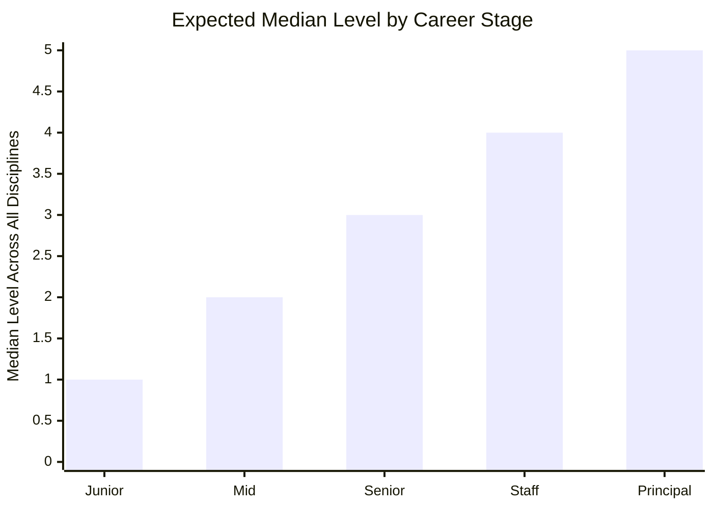

# Software Developer Progression Levels

## Overview

This document defines five progression levels for each of the seven software engineering disciplines described in the [software-developer-competency-framework](software-developer-competency-framework.md). Each level specifies what competence looks like and what observable evidence demonstrates it. The levels are cumulative -- each builds on the capabilities of the level below.

## Context

Traditional software engineering frameworks use four proficiency grades (Awareness, Working, Practitioner, Expert) or map directly to career levels (Junior through Principal). This framework uses five levels that are independent of job title. A Senior Engineer might be Level 4 in Engineering Craft but Level 2 in Leadership. A Tech Lead might be Level 4 in Leadership but Level 2 in Business Acumen. The levels measure depth within each discipline, not a single aggregate score.

---

## The Five Levels

| Level | Label | Definition | Analogy |
|-------|-------|-----------|---------|
| **1** | **Novice** | Understands the discipline conceptually. Can recognise its components and vocabulary. Cannot apply independently. Requires close guidance. | Follows a recipe step-by-step; cannot improvise when an ingredient is missing. |
| **2** | **Apprentice** | Applies basic techniques with guidance. Handles routine situations. Follows established patterns and templates. Developing confidence through practice. | Cooks familiar dishes reliably; struggles with unfamiliar cuisines. |
| **3** | **Practitioner** | Applies independently across standard and complex situations. Creates reusable patterns. Supports others. Handles ambiguity within known domains. | Cooks confidently from any recipe and improvises substitutions; coaches beginners. |
| **4** | **Strategist** | Leads and designs at team or project level. Resolves novel problems. Sets team-level standards. Anticipates failure modes before they occur. | Designs menus, manages a kitchen, creates original dishes, and trains other cooks. |
| **5** | **Architect** | Sets strategic direction at organisational scale. Defines the discipline's standards. Resolves the most ambiguous and novel challenges. Advances the practice. | Runs a restaurant group, defines culinary philosophy, and shapes how others learn to cook. |

### Level Distribution Across Career

> [!note]
> These are medians, not requirements. A Senior engineer might be Level 4 in their strongest discipline and Level 2 in their weakest. The framework measures depth within each discipline, not a single aggregate score.

---

## Progression by Discipline

### 1. Engineering Craft (Weight: 25)

| Level | What It Looks Like | Observable Evidence |
|-------|-------------------|---------------------|
| **1 -- Novice** | Writes basic code that works for simple cases. Understands fundamental programming concepts. Follows existing patterns when they are pointed out. Aware that testing, security, and architecture exist as concerns but cannot apply them independently. | Completes guided coding tasks. Code works but may lack error handling, edge case coverage, or readability. Relies on others for debugging. Tests are written only when required and with assistance. |
| **2 -- Apprentice** | Writes clean, functional code for well-scoped tasks. Writes unit tests for own code. Uses a debugger and reads stack traces. Follows team coding standards and architectural patterns. Understands common security vulnerabilities (OWASP top 10) conceptually. | Produces code that passes code review without major structural changes. Writes meaningful unit tests. Debugs straightforward issues independently. Follows established architectural patterns. Code is readable and adequately documented. |
| **3 -- Practitioner** | Designs and implements features end-to-end -- from understanding requirements through testing in production. Makes sound architectural decisions within established systems. Writes comprehensive tests at appropriate levels. Debugs complex, cross-system issues. Implements observability. Considers security implications proactively. | Delivers features that work correctly in production with appropriate test coverage. Contributes to architectural decisions with well-reasoned proposals. Debugs issues that cross service or system boundaries. Implements logging, metrics, and alerting for the systems they build. Code reviews catch security issues. |
| **4 -- Strategist** | Designs system architectures for new projects or major refactors. Sets coding standards and testing strategies for the team. Debugs the hardest production issues. Designs observability strategies. Leads security reviews. Evaluates technology choices and makes build-vs-buy recommendations. Understands and acts on engineering metrics. | Owns architectural decisions for significant systems. Establishes testing pyramids and quality gates. Is the escalation point for production debugging. Designs monitoring dashboards and alerting strategies used by the team. Leads threat modelling sessions. Engineering metrics inform their decision-making. |
| **5 -- Architect** | Defines technical strategy and engineering standards at organisational scale. Designs systems that span multiple teams and years. Resolves the most complex technical challenges. Sets the organisation's approach to testing, observability, security, and metrics. Advances engineering practice through tooling, patterns, or published thought leadership. | Owns cross-organisational architectural decisions. Establishes engineering-wide standards for code quality, testing, security, and observability. Designs systems at the highest level of complexity and scale. Is consulted on the hardest technical problems across the organisation. Builds tools or frameworks that improve engineering effectiveness at scale. |

---

### 2. Delivery (Weight: 18)

| Level | What It Looks Like | Observable Evidence |
|-------|-------------------|---------------------|
| **1 -- Novice** | Completes assigned tasks when clearly defined. Understands that work should be broken into smaller pieces but relies on others to do the decomposition. May batch work and deliver at the end rather than incrementally. Needs clear requirements to make progress. | Completes well-defined tickets. Asks for help when blocked rather than spinning. May struggle to estimate or scope own work. Delivers working code but not always in increments that are independently valuable. |
| **2 -- Apprentice** | Breaks down user stories into implementable tasks. Delivers work in small, frequent increments. Identifies obvious dependencies. Makes progress on moderately ambiguous tasks by asking clarifying questions. Estimates own work with reasonable accuracy. | Commits and deploys frequently. Stories are broken into tasks that the engineer can complete in 1-2 days. Identifies blocking dependencies and raises them proactively. Estimates are within reasonable range. Asks useful clarifying questions when requirements are unclear. |
| **3 -- Practitioner** | Breaks down complex features into independently valuable increments. Manages priorities across multiple work streams. Navigates significant ambiguity by making reasonable assumptions and validating them. Adjusts plans as new information emerges. Delivers reliably without close supervision. | Features are shipped in thin vertical slices that each deliver user value. Manages own backlog effectively. Makes forward progress on ambiguous problems by combining research, prototyping, and stakeholder conversations. Re-prioritises based on changing context. Delivery cadence is consistent and predictable. |
| **4 -- Strategist** | Plans delivery for team-level projects spanning multiple engineers and weeks. Designs work breakdown structures that manage risk and enable parallel effort. Resolves cross-team priority conflicts. Navigates high ambiguity -- organisational, technical, or strategic -- and creates clarity for others. | Owns delivery planning for significant projects. Work breakdowns enable parallel development with minimal blocking. Identifies and mitigates delivery risks before they materialise. Creates clarity from ambiguous situations -- others understand the path forward because this person defined it. Delivery plans are a tool the team relies on. |
| **5 -- Architect** | Defines delivery strategy at organisational scale. Designs delivery frameworks and planning approaches used across teams. Resolves the most complex planning and prioritisation challenges. Navigates strategic ambiguity -- market uncertainty, technology shifts, organisational change. | Owns delivery methodology and continuous improvement for the engineering organisation. Designs planning processes that scale across teams. Makes strategic prioritisation decisions that balance near-term delivery against long-term investment. Delivery approach becomes a competitive advantage for the organisation. |

---

### 3. Self Organisation (Weight: 10)

| Level | What It Looks Like | Observable Evidence |
|-------|-------------------|---------------------|
| **1 -- Novice** | Shows up and completes assigned work. Sometimes misses commitments or underestimates effort. Limited awareness of how own work connects to team goals. Does not yet think about the economic implications of engineering decisions. | Completes tasks but occasionally misses deadlines without early warning. Focuses on the task at hand without considering broader impact. May over-engineer or under-engineer because they do not yet think about effort-value trade-offs. |
| **2 -- Apprentice** | Meets commitments consistently. Communicates proactively when timelines shift. Understands that engineering decisions have costs and makes simple build-vs-buy evaluations. Takes ownership of assigned work through to completion. | Delivers on time or communicates early when delays are expected. Follows through on commitments without reminders. Makes reasonable decisions about where to invest effort -- does not gold-plate low-priority work. Owns assigned tasks from start to completion, including testing and deployment. |
| **3 -- Practitioner** | Is highly reliable -- the person the team does not worry about. Takes ownership of outcomes, not just tasks. Applies economic thinking across engineering decisions -- build-vs-buy, scope trade-offs, time investment. Manages own time and energy effectively across competing demands. | Track record of consistent delivery. Raises issues early and proposes solutions. Makes scope trade-offs that balance quality, speed, and effort appropriately. Manages multiple concurrent responsibilities without dropping balls. Team members and managers trust their commitments implicitly. |
| **4 -- Strategist** | Models reliability and accountability for the team. Coaches others on economic thinking and prioritisation. Designs systems and processes that make the team more reliable as a unit. Makes complex economic decisions about technical investment. | Sets the standard for reliability that others aspire to. Mentors junior engineers on time management and accountability. Makes technical debt and investment decisions with clear economic reasoning. Designs team processes (on-call, deployment, review) that build collective reliability. |
| **5 -- Architect** | Defines organisational standards for engineering accountability and economic decision-making. Designs frameworks for evaluating engineering investment at portfolio level. Models self-organisation at the highest level of complexity and ambiguity. | Establishes engineering investment frameworks used across the organisation. Defines accountability standards and cultural norms. Makes strategic economic decisions about technology platform investments. Sets expectations for reliability and ownership that shape engineering culture. |

---

### 4. Feedback (Weight: 13)

| Level | What It Looks Like | Observable Evidence |
|-------|-------------------|---------------------|
| **1 -- Novice** | Communicates in basic written and verbal form. Gives and receives feedback when prompted. Aware that knowledge sharing benefits the team but does not yet do it proactively. | Writes clear commit messages and basic documentation. Responds to code review comments. Participates in team discussions when asked. Communication is functional but may lack precision or structure. |
| **2 -- Apprentice** | Communicates technical concepts clearly to peers. Provides useful code review feedback. Actively seeks feedback on own work. Shares knowledge informally -- answers questions, helps teammates. | Code reviews are specific and constructive. Asks for feedback during development, not just after. Writes useful documentation for the work they build. Helps teammates who are stuck. Communication adapts to context -- more detail in code reviews, less in status updates. |
| **3 -- Practitioner** | Communicates complex technical topics clearly to both technical and non-technical audiences. Gives feedback that improves others' work significantly. Actively seeks feedback and visibly incorporates it. Shares knowledge proactively -- writes documentation, gives presentations, contributes to team knowledge bases. | Technical documents and proposals are clear and well-structured. Code reviews consistently improve code quality and teach the author something. Seeks feedback from diverse sources and demonstrates visible changes based on it. Proactively documents decisions, architecture, and operational knowledge. Others rely on their written artifacts. |
| **4 -- Strategist** | Sets communication and feedback standards for the team. Gives feedback on the hardest topics -- performance, career development, interpersonal dynamics. Designs knowledge management systems for the team. Coaches others on communication and feedback skills. | Defines code review standards and feedback norms for the team. Has difficult conversations effectively -- the result is improved performance, not damaged relationships. Builds and maintains team knowledge bases, runbooks, and onboarding materials. Mentors others on technical writing and communication skills. |
| **5 -- Architect** | Defines communication and knowledge management strategy at organisational scale. Gives feedback that shapes careers and organisational direction. Designs systems for capturing and distributing organisational knowledge. Represents the engineering organisation in external communication. | Establishes engineering communication standards used across the organisation. Designs knowledge management systems at enterprise scale. Gives feedback that influences organisational strategy and structure. Represents the engineering team externally -- conferences, publications, industry discussions. |

---

### 5. Collaboration (Weight: 12)

| Level | What It Looks Like | Observable Evidence |
|-------|-------------------|---------------------|
| **1 -- Novice** | Works alongside teammates. Participates in team activities when included. Generally agreeable in discussions. Avoids conflict rather than engaging with it. | Attends team meetings and participates minimally. Completes individual work that contributes to team goals. May struggle with pair programming or collaborative design. Defers to others in disagreements. |
| **2 -- Apprentice** | Collaborates actively within the immediate team. Builds working relationships with direct teammates. Engages in technical disagreements constructively -- states own views and listens to others. Pairs with teammates and participates in collaborative design sessions. | Participates actively in team ceremonies and discussions. Has established working relationships with teammates. Disagrees constructively -- raises concerns with suggested alternatives. Pairs effectively and contributes to collaborative design. |
| **3 -- Practitioner** | Collaborates effectively across team boundaries. Builds relationships with engineers, product managers, designers, and other functions. Handles technical and interpersonal disagreements with skill -- advocates firmly for positions while remaining open to being wrong. Volunteers for collaborative work. | Collaborates with other teams on cross-cutting initiatives. Has strong relationships across functions. Navigates disagreements by focusing on trade-offs and evidence rather than opinions. Supports teammates beyond their direct responsibilities. Is sought out for collaborative work. |
| **4 -- Strategist** | Models collaboration for the team. Builds relationships at the leadership level across the organisation. Resolves cross-team conflicts and disagreements. Creates structures that foster team collaboration -- pairing rotations, cross-functional squads, shared ownership models. | Resolves cross-team disagreements by finding solutions that serve both teams. Builds and maintains relationships with leaders across the organisation. Designs team structures and practices that promote collaboration. Coaches others on relationship building and conflict resolution. Team collaboration measurably improves under their influence. |
| **5 -- Architect** | Defines collaboration culture at organisational scale. Builds and maintains relationships at the executive level. Resolves the most consequential organisational disagreements. Designs organisational structures that enable collaboration at scale. | Shapes engineering culture around collaboration norms. Resolves disagreements that affect organisational direction. Designs team topologies and interaction modes at organisational scale. Represents engineering in cross-functional leadership. Collaboration quality is a visible part of their leadership legacy. |

---

### 6. Leadership (Weight: 15)

| Level | What It Looks Like | Observable Evidence |
|-------|-------------------|---------------------|
| **1 -- Novice** | Understands that leadership exists beyond formal authority. Follows decisions made by team leads and senior engineers. Aware that processes exist and have rationale. Does not yet mentor others or facilitate discussions independently. | Follows team processes and decisions. Understands why decisions were made when explained. Asks questions that show awareness of team direction and process. Does not yet influence decisions or guide others. |
| **2 -- Apprentice** | Makes sound decisions within own scope of work. Contributes to team alignment by communicating own status and plans clearly. Begins to mentor junior engineers informally. Understands team processes and suggests minor improvements. Facilitates simple discussions (e.g., standups) with structure. | Makes technical decisions independently for own work. Contributes useful input to team planning and direction-setting. Helps junior engineers with specific problems. Follows and supports team processes. Can run a structured meeting with a clear agenda. |
| **3 -- Practitioner** | Makes decisions that affect the team -- technology choices, architectural approaches, process changes. Drives alignment within the team on technical direction. Mentors junior and mid-level engineers consistently. Thinks about process improvement and acts on it. Facilitates design discussions and retrospectives effectively. | Leads technical decisions that the team follows. Aligns the team on approaches through clear proposals and discussion. Has mentees who show measurable growth. Identifies and implements process improvements. Facilitates discussions that produce clear decisions and action items. |
| **4 -- Strategist** | Makes decisions that affect multiple teams or the broader organisation. Drives alignment across teams on technical strategy and standards. Mentors senior engineers. Designs processes that improve how the team or organisation works. Facilitates high-stakes discussions involving conflicting perspectives. | Owns technical decisions that span teams. Drives cross-team alignment on architecture, standards, or strategy. Mentors engineers into senior roles. Designs and implements processes adopted across teams. Facilitates discussions where stakes are high and perspectives differ -- the result is alignment rather than compromise. |
| **5 -- Architect** | Makes strategic decisions at organisational scale. Sets the technical direction for the engineering organisation. Mentors staff-level engineers and emerging leaders. Defines processes and governance at organisational level. Facilitates the most consequential discussions -- reorgs, technology shifts, strategic pivots. | Shapes the engineering organisation's technical direction. Decisions have multi-year, multi-team impact. Develops the next generation of technical leaders. Defines engineering governance and decision-making frameworks. Facilitates decisions that shape the organisation's future. |

---

### 7. Business Acumen & Strategy (Weight: 7)

| Level | What It Looks Like | Observable Evidence |
|-------|-------------------|---------------------|
| **1 -- Novice** | Understands that software exists to serve business and user needs. Aware that the company has a revenue model and competitors. Does not yet connect engineering decisions to business outcomes. | Can describe what the product does and who uses it. Follows product requirements as given. Understands that features have business justification. Does not yet contribute to product or business discussions. |
| **2 -- Apprentice** | Understands the product domain and user workflows. Connects engineering work to user value -- can explain why a feature matters. Makes simple product trade-off decisions with guidance. Understands the basic business model. | Explains engineering work in terms of user impact. Makes product-aware decisions -- chooses implementation approaches that serve users better. Participates in product discussions with useful input. Understands the revenue model and competitive landscape at a basic level. |
| **3 -- Practitioner** | Thinks about engineering work through a product lens. Identifies opportunities where engineering investment creates disproportionate user value. Makes product trade-off decisions independently. Understands the business well enough to prioritise technical debt against business impact. Contributes to product roadmap discussions. | Proactively identifies product improvements during engineering work. Makes build decisions that account for business context -- timing, cost, competitive pressure. Participates in roadmap planning with insights that influence direction. Prioritises technical debt based on business impact, not just engineering preference. Product managers value their input. |
| **4 -- Strategist** | Shapes product direction through technical insight. Makes strategic technology decisions that create business advantage. Evaluates market and competitive dynamics to inform engineering investment. Connects technical roadmap to business strategy. | Engineering decisions visibly improve business outcomes. Identifies technology-driven opportunities that product management did not see. Makes build-vs-buy decisions with clear strategic reasoning. Technology roadmap explicitly connects to business objectives. Trusted by business leadership for strategic technical judgment. |
| **5 -- Architect** | Defines how engineering creates business value at organisational scale. Shapes company strategy through technology perspective. Evaluates market trends and technology shifts to inform organisational direction. Makes engineering investment decisions at the portfolio level. | Influences company strategy through technology insight. Makes multi-year technology investment decisions with clear business justification. Identifies emerging technology trends that create strategic opportunity or risk. Trusted by executive leadership as a strategic thought partner. Engineering is recognised as a business differentiator because of their influence. |

---

## Cross-Discipline Summary

The table below maps expected level ranges by career stage. These are guidelines, not requirements -- individual profiles will vary significantly.

| Discipline | Junior (L0-L1) | Mid (L1-L2) | Senior (L2-L3) | Staff (L3-L4) | Principal (L5) |
|-----------|----------------|-------------|-----------------|----------------|----------------|
| Engineering Craft | 1-2 | 2-3 | 3-4 | 4 | 4-5 |
| Delivery | 1 | 2 | 2-3 | 3-4 | 4-5 |
| Self Organisation | 1 | 1-2 | 2-3 | 3-4 | 4-5 |
| Feedback | 1 | 1-2 | 2-3 | 3-4 | 4-5 |
| Collaboration | 1 | 1-2 | 2-3 | 3-4 | 4-5 |
| Leadership | 1 | 1-2 | 2-3 | 3-4 | 4-5 |
| Business Acumen & Strategy | 1 | 1 | 1-2 | 2-3 | 3-5 |

> [!tip]
> Use this table to identify where you are ahead of or behind the expected curve. Focus development effort on the disciplines with the highest framework weight where your level is below the expected range for your career stage. A Senior engineer at Level 1 in Delivery (weight 18) should prioritise that over reaching Level 5 in Self Organisation (weight 10).

---

## Assessment Method

For each discipline at each level, evidence should be drawn from observable artifacts:

- **Code and systems built** -- quality, complexity, reliability, and production impact
- **Work delivered** -- cadence, scope management, and value created per increment
- **Feedback given and received** -- code reviews, design reviews, and interpersonal feedback that led to measurable improvement
- **Collaborations led** -- cross-team initiatives, conflict resolutions, and relationship quality
- **Decisions made** -- quality, timeliness, and outcomes of technical and organisational decisions
- **Others developed** -- mentees who grew, knowledge shared, and team capability lifted
- **Business impact created** -- product improvements, strategic insights, and engineering-driven business outcomes

> [!warning]
> Self-assessment is unreliable. The Dunning-Kruger effect is well-documented in software engineering: junior engineers overestimate their competence while senior engineers underestimate theirs. Peer assessment, manager calibration, and artifact-based evaluation are essential. Ratings without evidence should be challenged.